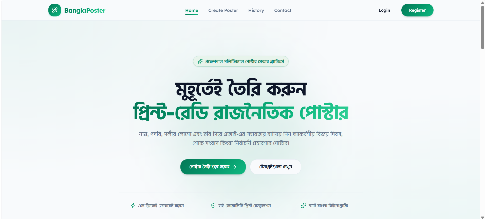
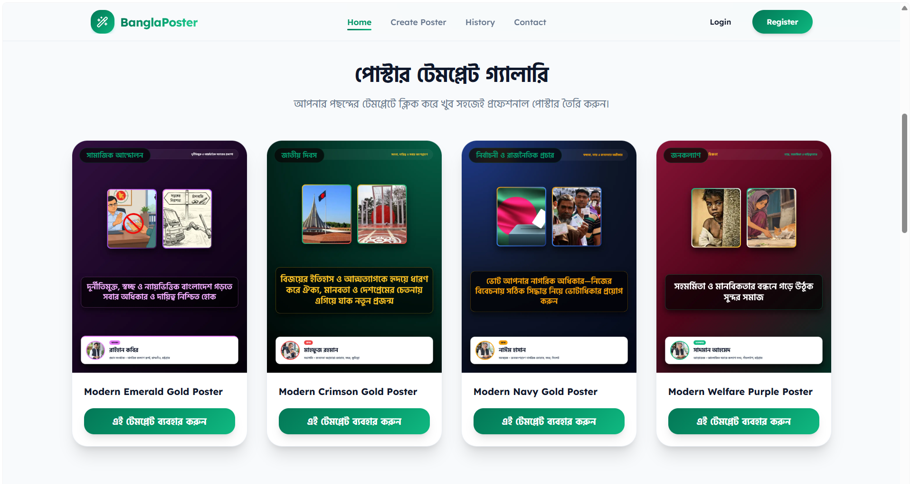

# 🎨 AI Political Poster Maker - Frontend Application

> A modern, responsive, and intuitive web application built with **Next.js (TypeScript), Tailwind CSS, Lucide React, and Shadcn UI** designed for local political workers, committee members, and campaigners to generate professional, print-ready political posters effortlessly.

---

## 🌐 Project Links & Resources

* **Live Platform URL:** [https://banglaposter.infozia.site](https://banglaposter.infozia.site)
* **Frontend Repository:** [https://github.com/hridoy-web/bangla-poster-frontend](https://github.com/hridoy-web/bangla-poster-frontend)
* **Backend Repository:** [https://github.com/hridoy-web/political_poster_backend](https://github.com/hridoy-web/political_poster_backend)

---

## 🚀 Tech Stack & Core Dependencies

* **Framework:** Next.js (with TypeScript)
* **Styling & Design System:** Tailwind CSS & Shadcn UI
* **Icons:** Lucide React
* **State Management & Routing:** React Hooks & Next.js App Router
* **Form & Validation Management:** Controlled components with seamless API integration
* **Communication:** Axios/Fetch API for secure backend integration and Web3Forms for contact inquiries

---

## ✨ Core Features & Functionality

* **Curated Template Gallery:** Browse and select from various professional poster templates categorized by national occasions, social movements, and campaigns.
* **Dynamic Poster Creation Form:** Input custom details including author name, designation, political/organization name, location, headline text, and upload up to 3 context/leader photos.
* **Smart Authentication & Redirection:** Secure user registration and login flow featuring smart post-login/register redirection to ensure a smooth user experience.
* **Poster Generation History:** View, inspect in fullscreen, and download previously created posters directly from the user account history.
* **Interactive Contact & Support Page:** Fully integrated contact page powered by Web3Forms for bug reporting, feature suggestions, and direct support inquiries.
* **Responsive UI/UX Pass:** Optimized across mobile, tablet, and desktop viewports with a polished modern aesthetic.

---

## 📸 Application Preview & Screenshots

Explore the modern user interface and template gallery of the application:

<table>
  <tr>
    <td align="center" width="50%">
      <b>1. Hero Section & Landing Interface</b><br><br>
      
    </td>
    <td align="center" width="50%">
      <b>2. Template Gallery & Customization</b><br><br>
      
    </td>
  </tr>
</table>

---

## 🛠️ Getting Started & Local Installation

Follow these steps to set up and run the frontend application locally:

### 1. Clone the Repository
```bash
git clone https://github.com/hridoy-web/bangla-poster-frontend.git
```
```
cd bangla-poster-frontend
```

### 2. Install Dependencies

```bash
npm install
```

### 3. Configure Environment Variables

Create a `.env` file in the root directory and add your backend API endpoint configuration:

```env
NEXT_PUBLIC_API_URL=http://localhost:5000/api/v1
NEXT_PUBLIC_CONTACT_API_KEY=your_Web3Forms_api_key
```

### 4. Run the Development Server

```bash
npm run dev
```
